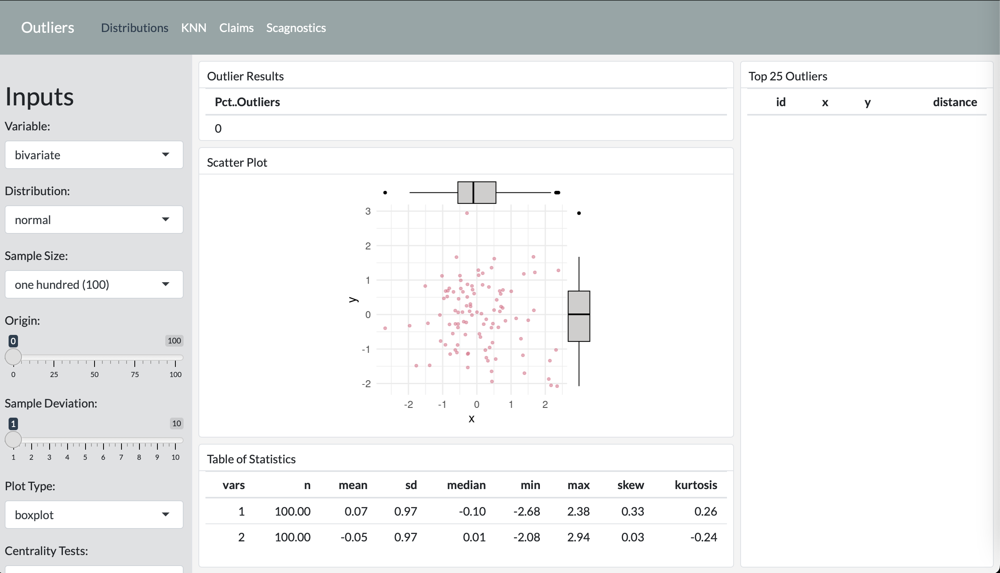

---

# outliers_dash

The `outliers_dash` generates an interactive flex dashboard that illustrates the concepts in the accompanying presentation. You can find the presentation [here](https://robwiederstein.github.io/outliers_pres/).

## Contributing

Contributions are what make the open source community such an amazing place to learn, inspire, and create. Any contributions you make are **greatly appreciated**.

If you have a suggestion that would make this better, please fork the repo and create a pull request. You can also simply open an issue with the tag "enhancement".
Don't forget to give the project a star! Thanks again!

1. Fork the Project
2. Create your Feature Branch (`git checkout -b feature/AmazingFeature`)
3. Commit your Changes (`git commit -m 'Add some AmazingFeature'`)
4. Push to the Branch (`git push origin feature/AmazingFeature`)
5. Open a Pull Request

## License

Distributed under the MIT License. See [`LICENSE.md`]("https://github.com/RobWiederstein/outliers_dash/blob/main/LICENSE.md") for more information.

## Acknowledgements

- Professor Talagala whose academic paper and numerous repositories have been extremely helpful and form the basis of this dashboard.

- Centers for Medicare and Medicaid Services for the publicly available claims data.

## Contact

Rob Wiederstein - [Linked In](https://www.linkedin.com/in/rob-wiederstein-797553138/)
